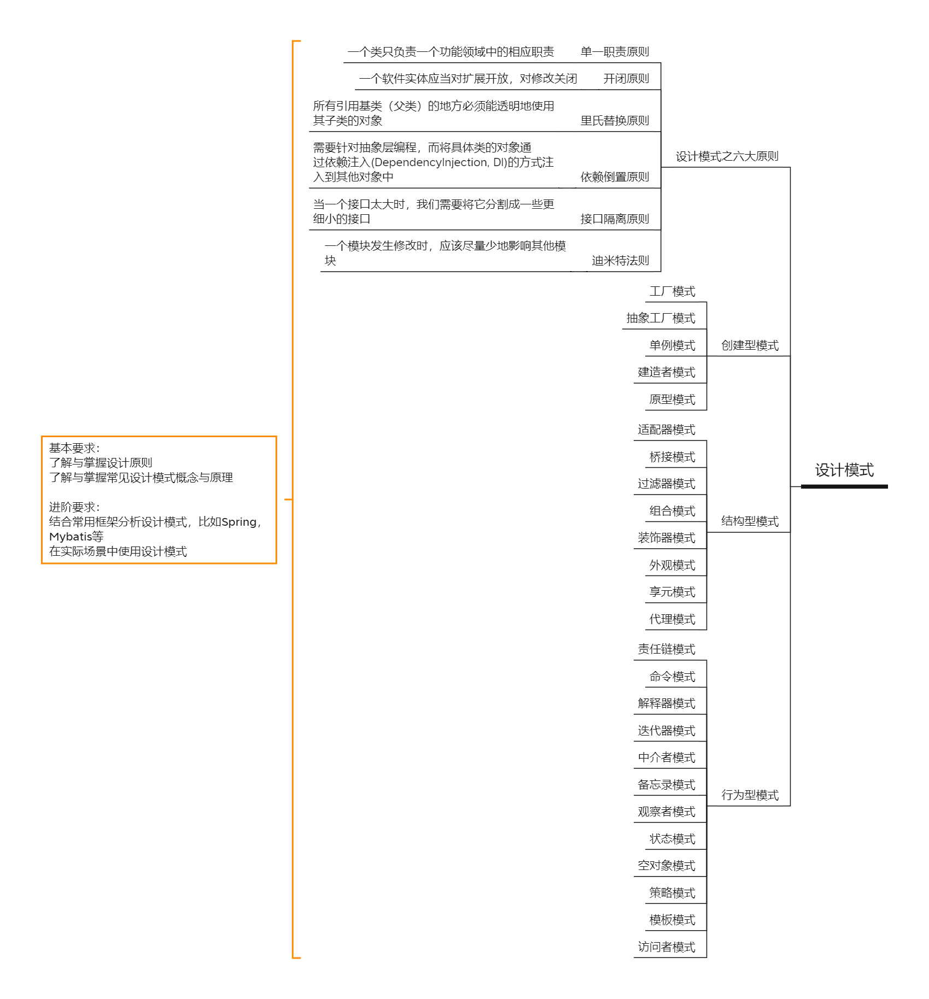

# 设计模式
## 六大原则
### 单一职责原则
一个类只负责一个功能领域中的相应职责
### 开闭原则
一个软件实体应当对扩展开放，对修改关闭
### 里氏替换原则
所有引用基类（父类）的地方必须能透明地使用其子类的对象
### 依赖倒置原则
需要针对抽象层编程，而将具体类的对象通过依赖注入(DependencyInjection, DI)的方式注入到其他对象中
### 接口隔离原则
当一个接口太大时，我们需要将它分割成一些更细小的接口
### 迪米特法则
一个模块发生修改时，应该尽量少地影响其他模块

